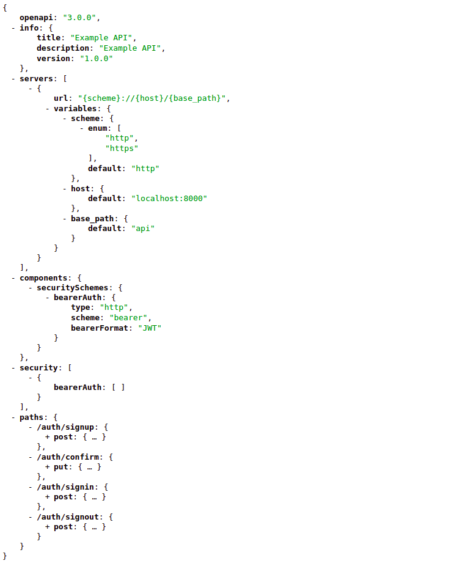
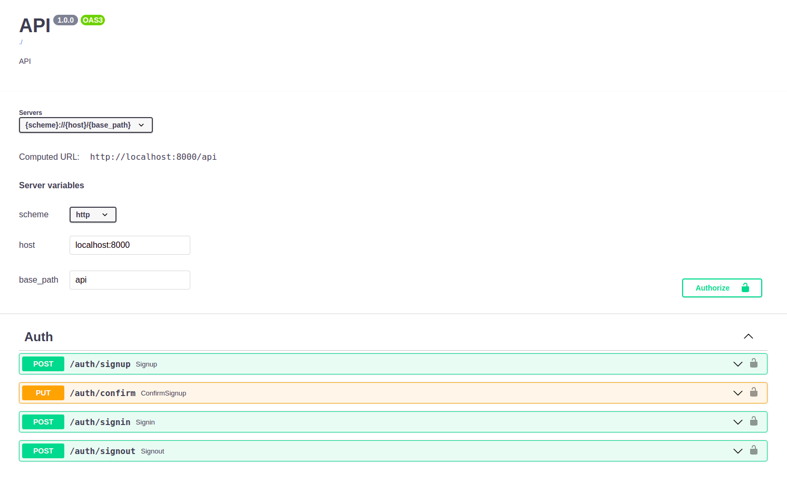

# PHP OpenAPI






## Installation

### Standalone

- Clone project
- Run `composer update`
- Check `src/Document` directory as sample and create your own `OpenAPIOperationGenerator` and `OpenAPIDocumentGenerator`

  `OpenAPIOperationGenerator` is responsible to generate Open API Operations and `OpenAPIDocumentGenerator` is
  responsible to generate Open API json document. Each public method of `OpenAPIOperationGenerator` generates one Open
  API Operation (Using reflection).

- Run `php -S localhost:8001` in project root directory

  - Open `http://loclahost:8001` in your browser for Open API json document
  - Open `http://loclahost:8001?swagger` in your browser for Open API Swagger UI

### Dependency of existing project

- Install package

    ```shell
    composer require alireza-h/php-openapi
    ```

- Check `src/Document` directory as sample and create your own `OpenAPIOperationGenerator`
  and `OpenAPIDocumentGenerator`

  Instead of using `OpenAPIDocumentGenerator`, you can create your own `OpenAPIBuilder` object and
  add `OpenAPIOperation` to builder object.

  ```
  OpenAPIBuilder::openapi()
      ->info(
          [
              'title' => 'API',
              'description' => 'API Description',
              'version' => '1.0.0'
          ]
      )
      ->server(
          [
              'url' => '{scheme}://{host}/{base_path}',
              'variables' => [
                  'scheme' => [
                      'enum' => [
                          'http',
                          'https'
                      ],
                      'default' => 'http'
                  ],
                  'host' => [
                      'default' => 'localhost:8000'
                  ],
                  'base_path' => [
                      'default' => 'api'
                  ],
              ]
          ]
      )
      ->component(
          'securitySchemes',
          'bearerAuth',
          [
              'type' => 'http',
              'scheme' => 'bearer',
              'bearerFormat' => 'JWT',
          ]
      )
      ->security(
          [
              'bearerAuth' => []
          ]
      )
      ->operation(
          OpenAPIOperation::post('/auth/signup')
              ->tags(['Auth'])
              ->summary('Signup')
              ->description('Signup description')
              ->requestBody(
                  OpenAPIRequestBody::create()
                      ->properties(
                          [
                              [
                                  'name' => 'email',
                                  'type' => 'string',
                                  'format' => 'email',
                                  'example' => 'email@example.com',
                                  'description' => 'Email',
                              ],
                              ...
                          ]
                      )
                      ->mediaTypeMultipartFormData()
              )
              ->response(
                  OpenAPIResponse::create()
                      ->example(
                          [
                              'data' => [],
                              'message' => null
                          ]
                      )
              )
      )
      ->operation(
          OpenAPIOperation::put('/auth/confirm')
              ->tags(['Auth'])
              ->summary('ConfirmSignup')
              ->description('Confirm signup description')
              ->requestBody(
                  OpenAPIRequestBody::create()
                      ->properties(
                          [
                              [
                                  'name' => 'email',
                                  'type' => 'string',
                                  'format' => 'email',
                                  'example' => 'email@example.com',
                                  'description' => 'Email',
                              ],
                              [
                                  'name' => 'code',
                                  'example' => 12345,
                              ]
                          ]
                      )
                      ->mediaTypeXWwwFormUrlencoded()
              )
              ->response(
                  OpenAPIResponse::create()
                      ->example(
                          [
                              'data' => [],
                              'message' => null
                          ]
                      )
              )
      )
      ->json();
  ```

- Create your own custom route to serve Open API json document and swagger UI
