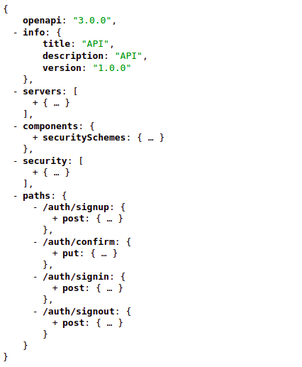

# PHP OpenAPI




## Installation

### Standalone

- Clone project
- Run `composer update`
- Check `src/Document` directory as sample and create your own `OpenAPIOperationGenerator` and `OpenAPIDocumentGenerator`

  `OpenAPIOperationGenerator` is responsible to generate Open API Operations and `OpenAPIDocumentGenerator` is
  responsible to generate Open API json document. Each public method of `OpenAPIOperationGenerator` generates one Open
  API Operation.

- Run `php -S localhost:8001` in project root directory

  - Open `http://loclahost:8001` is your browser for Open API json document
  - Open `http://loclahost:8001?swagger` is your browser for Open API Swagger UI

### Dependency of existing project

- Install package

    ```shell
    composer require alireza-h/php-openapi
    ```

- Check `src/Document` directory as sample and create your own `OpenAPIOperationGenerator` and `OpenAPIDocumentGenerator`
- Create your own custom route to serve Open API json document and swagger UI
